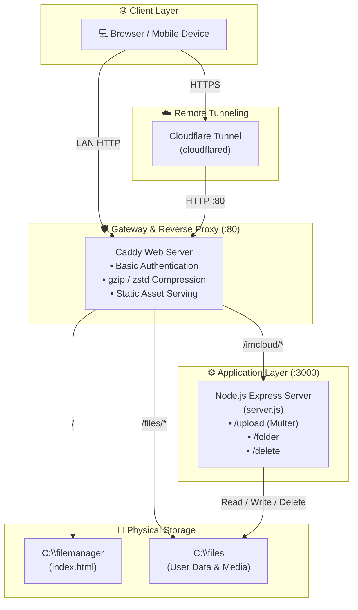

# ☁️ IMCLOUD — Personal Cloud Vault

<div align="center">


**A high-performance, self-hosted personal cloud vault and file management system.**  
*Host your own drive. Zero subscription fees. 100% data ownership.*

[](https://nodejs.org/)
[](https://expressjs.com/)
[](https://caddyserver.com/)
[](https://developers.cloudflare.com/cloudflare-one/connections/connect-networks/)
[](LICENSE)

[Features](#-features) • [Architecture](#-system-architecture) • [Directory Layout](#-directory-layout) • [Quick Start](#-step-by-step-installation) • [API Docs](#-api-documentation) • [Troubleshooting](#-troubleshooting--faq)

---

</div>

## 📌 Overview

**IMCLOUD** is a self-hosted cloud storage solution that turns your local computer or home server into a private cloud storage vault. It provides a sleek, modern, dark-mode web application for managing, uploading, organizing, and previewing files stored directly on your physical hard drive—accessible both locally on your home network and remotely from anywhere in the world.

---

## ✨ Features

### 🎨 User Interface & Experience
- **Modern Glassmorphic Dark UI:** Handcrafted CSS with custom tokens, fluid animations, and responsive layouts tailored for mobile, tablet, and desktop.
- **Zero-Dependency Frontend:** Built entirely with pure Vanilla HTML5, CSS3, and ES6+ JavaScript. Fast load times with zero build steps or npm bundling overhead on the client.
- **Instant Search & Filter:** Real-time client-side file and folder search with dynamic breadcrumb navigation.

### 📁 Storage & File Management
- **Large File Support:** Seamless multipart file uploads supporting files up to **5 GB** per upload via streaming disk storage.
- **Drag-and-Drop:** Drag multiple files or folders directly into the browser to trigger instant uploads.
- **Directory Hierarchy:** Create deeply nested folder structures and delete files or entire directories recursively.

### 👁️ Rich In-Browser Previews
| Media Type | Supported Formats |
|---|---|
| **🖼️ Images** | `.jpg`, `.jpeg`, `.png`, `.gif`, `.webp`, `.svg`, `.bmp` |
| **🎬 Video** | `.mp4`, `.webm`, `.mkv`, `.mov` |
| **🎵 Audio** | `.mp3`, `.wav`, `.ogg`, `.aac`, `.m4a` |
| **📄 Documents** | `.pdf` (interactive viewer) |
| **💻 Code & Text** | `.txt`, `.json`, `.js`, `.css`, `.html`, `.md`, `.py`, `.c`, `.cpp` |

### 🔒 Enterprise-Grade Security
- **Path Traversal Protection:** Absolute boundary verification (`getSafePath`) prevents unauthorized filesystem access outside the storage root (`C:\files`).
- **Windows System Reserved Name Shield:** Blocks dangerous OS-reserved filenames and invalid character patterns (`CON`, `PRN`, `AUX`, `NUL`, `COM1-9`, `LPT1-9`, `*`, `?`, etc.).
- **HTTP Basic Authentication:** Secured at the gateway layer with Caddy and password hashing.
- **Zero-Port-Forwarding Remote Access:** Encrypted tunnel via Cloudflare Tunnel (`cloudflared`) to expose your vault safely without exposing your public IP or opening router ports.

---

## 🏛️ System Architecture

### Component Diagram



### Component & Port Mapping

| Service | Port | Endpoint / Target | Purpose |
|---|---|---|---|
| **Caddy Gateway** | `:80` | `http://localhost:80` | Entry point, authentication, static asset server, reverse proxy |
| **Node.js Express API** | `:3000` | `http://127.0.0.1:3000` | REST API for file upload, folder creation, and deletions |
| **Cloudflare Tunnel** | *Dynamic* | `https://*.trycloudflare.com` | Secure public outbound tunnel for remote access |

---

## 📂 Directory Layout

To set up IMCLOUD, organize your Windows file system into the following structure:

```plaintext
C:\
├── files\                          <-- [Physical Storage Root] User files and folders
│   ├── Documents\
│   │   ├── Contract.pdf
│   │   └── Notes.txt
│   ├── Photos\
│   │   └── Landscape.jpg
│   └── Videos\
│       └── Demo.mp4
│
├── filemanager\                    <-- [Frontend Web Root]
│   └── index.html                  <-- IMCLOUD single-page web application
│
└── server\                         <-- [Backend & Server Configuration]
    ├── Caddyfile.txt               <-- Caddy reverse proxy & auth configuration
    └── upload-server\              <-- Node.js API server
        ├── package.json            <-- Project manifest & dependencies
        ├── node_modules\           <-- Installed Node modules
        └── server.js               <-- Express REST backend
```

---

## 📦 Prerequisites

Ensure the following tools are installed on your Windows machine:

1. **Node.js (v18 or higher):** Download from [nodejs.org](https://nodejs.org/) or install via winget:
   ```powershell
   winget install OpenJS.NodeJS.LTS
   ```
2. **Caddy Web Server:**
   ```powershell
   winget install Caddyserver.Caddy
   ```
3. **Cloudflare Tunnel CLI (`cloudflared`):**
   ```powershell
   winget install Cloudflare.Cloudflared
   ```

Verify installations in PowerShell:
```powershell
node -v
caddy version
cloudflared --version
```

---

## 🚀 Step-by-Step Installation

### Step 1: Create Directories
Open **PowerShell as Administrator** and create the required directory structure:

```powershell
New-Item -Path "C:\files" -ItemType Directory -Force
New-Item -Path "C:\filemanager" -ItemType Directory -Force
New-Item -Path "C:\server\upload-server" -ItemType Directory -Force
```

---

### Step 2: Deploy Application Files

1. **Frontend:** Copy `index.html` to `C:\filemanager\index.html`.
2. **Backend:** Copy `server.js` to `C:\server\upload-server\server.js`.
3. **Gateway:** Copy `Caddyfile_imcloud.txt` to `C:\server\Caddyfile.txt`.

---

### Step 3: Install Node.js Backend Dependencies

Navigate to the upload server folder and install dependencies:

```powershell
cd C:\server\upload-server
npm init -y
npm install express multer
```

---

### Step 4: Configure Authentication in Caddyfile

1. **Generate your password hash:**
   ```powershell
   caddy hash-password
   ```
   *Enter your desired password when prompted. Copy the resulting bcrypt/argon2 hash code.*

2. **Edit `C:\server\Caddyfile.txt`:**
   Replace `USERNAME` and `YOUR_HASHCODE` with your actual username and generated hash code:

   ```caddy
   :80 {
       encode gzip zstd

       basic_auth {
           admin $2a$14$Z1M8Q6bCjK1mO...YOUR_HASH_HERE...
       }

       handle /imcloud/* {
           uri strip_prefix /imcloud
           reverse_proxy 127.0.0.1:3000
       }

       handle_path /files/* {
           root * C:\files
           file_server browse
           header Cache-Control "public, max-age=86400"
       }

       handle {
           root * C:\filemanager
           try_files {path} /index.html
           file_server
       }
   }
   ```

---

## 🏃 Running the Services

To bring IMCLOUD online, launch the 3 services in separate PowerShell terminal windows:

### 1️⃣ Terminal 1 — Start the Backend API Server
```powershell
node C:\server\upload-server\server.js
```
> Output: `IMCLOUD server running on http://127.0.0.1:3000`

### 2️⃣ Terminal 2 — Start the Caddy Reverse Proxy Gateway
```powershell
caddy run --config C:\server\Caddyfile.txt
```
> Web UI is now available locally at: `http://localhost` (or your local LAN IP e.g. `http://192.168.1.x`)

### 3️⃣ Terminal 3 — Start the Cloudflare Remote Tunnel
```powershell
cloudflared tunnel --url http://localhost:80
```
> Copy the generated public URL (e.g. `https://random-words.trycloudflare.com`) to access your vault from any mobile device or remote PC worldwide.

---

## ⚡ Optional: One-Click Startup Script

Create a file named `Start-IMCloud.ps1` to launch all 3 processes simultaneously in minimized windows:

```powershell
# Start-IMCloud.ps1
Start-Process powershell -ArgumentList "-NoExit", "-Command", "node C:\server\upload-server\server.js" -WindowStyle Minimized
Start-Process powershell -ArgumentList "-NoExit", "-Command", "caddy run --config C:\server\Caddyfile.txt" -WindowStyle Minimized
Start-Process powershell -ArgumentList "-NoExit", "-Command", "cloudflared tunnel --url http://localhost:80"
```

---

## 🔌 API Documentation

All API requests through the proxy are prefixed with `/imcloud`.

### 1. Upload File
Uploads a single file to a designated folder.

- **URL:** `POST /imcloud/upload`
- **Headers:** `Content-Type: multipart/form-data`
- **Body Parameters:**
  - `file` *(binary, required)*: The file payload (max 5 GB).
  - `folderPath` *(string, optional)*: Target destination directory relative to `C:\files`.
- **Sample Request (cURL):**
  ```bash
  curl -X POST http://localhost/imcloud/upload \
       -F "file=@document.pdf" \
       -F "folderPath=Documents"
  ```
- **Success Response (`200 OK`):**
  ```json
  {
    "success": true,
    "name": "document.pdf",
    "size": 245800,
    "path": "Documents"
  }
  ```

---

### 2. Create Folder
Creates a new directory within the storage root.

- **URL:** `POST /imcloud/folder`
- **Headers:** `Content-Type: application/json`
- **Body Parameters:**
  ```json
  {
    "name": "ProjectAlpha",
    "folderPath": "Documents"
  }
  ```
- **Success Response (`201 Created`):**
  ```json
  {
    "success": true,
    "name": "ProjectAlpha",
    "path": "Documents\\ProjectAlpha"
  }
  ```

---

### 3. Delete File or Folder
Deletes a file or directory recursively.

- **URL:** `DELETE /imcloud/delete`
- **Headers:** `Content-Type: application/json`
- **Body Parameters:**
  ```json
  {
    "itemPath": "Documents/ProjectAlpha"
  }
  ```
- **Success Response (`200 OK`):**
  ```json
  {
    "success": true,
    "type": "folder",
    "path": "Documents/ProjectAlpha"
  }
  ```

---

## ⚙️ Configuration & Customization

| Setting | File Location | How to Change |
|---|---|---|
| **Max File Size Limit** | `server.js` | Update `limits: { fileSize: 5 * 1024 * 1024 * 1024 }` (default: 5GB). |
| **Storage Root Path** | `server.js` & `Caddyfile.txt` | Update `STORAGE_ROOT` in `server.js` and `root * C:\files` in `Caddyfile.txt`. |
| **Backend API Port** | `server.js` & `Caddyfile.txt` | Change `3000` in `app.listen(3000, ...)` and `reverse_proxy 127.0.0.1:3000`. |
| **Gateway Port** | `Caddyfile.txt` | Change `:80` to `:8080` or desired port. |

---

## ❓ Troubleshooting & FAQ

### 1. Caddy fails to bind to port 80 (`bind: address already in use`)
- **Reason:** Another service (such as IIS, Apache, Skype, or Windows World Wide Web Publishing Service) is using port 80.
- **Solution:** Stop the conflicting service in Windows Services (`services.msc` -> `World Wide Web Publishing Service` -> Stop), or change `:80` in `Caddyfile.txt` to `:8080` and adjust the Cloudflare command to `cloudflared tunnel --url http://localhost:8080`.

### 2. "Invalid storage path" error on upload or folder creation
- **Reason:** Path traversal attempt or invalid special characters detected.
- **Solution:** Ensure folder names do not contain characters like `..`, `:`, `/`, `\`, `?`, `*`, `<`, `>`, `|`.

### 3. File upload returns 413 "File is too large"
- **Reason:** The file exceeds the configured limit (5 GB).
- **Solution:** Increase the `fileSize` parameter in `server.js` under `multer({ limits: { fileSize: ... } })`.

### 4. What happens when the host computer is turned off?
- Because IMCLOUD is 100% self-hosted on your hardware, the service is offline when the host machine is turned off or asleep. Configure your PC's power options to prevent sleep mode when hosting 24/7.

---

## 📜 License

This project is licensed under the [MIT License](LICENSE). Feel free to use, modify, and distribute for personal or commercial use.